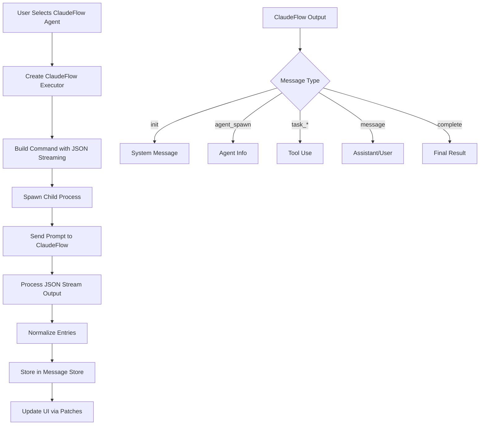

# Claude-Flow Integration Plan for Vibe-Kanban

## Overview
This plan outlines the integration of claude-flow as a new agent option in the vibe-kanban project, enabling users to leverage the claude-flow swarm intelligence platform for task execution.

## Current Agent System Architecture

### Agent Implementation Pattern
The vibe-kanban project uses a standardized pattern for implementing coding agents:

1. **Agent Enum**: All agents are defined in the `CodingAgent` enum in `/crates/executors/src/executors/mod.rs`
2. **Executor Implementation**: Each agent has its own executor module (e.g., `claude.rs`, `gemini.rs`)
3. **Standard Interface**: All agents implement the `StandardCodingAgentExecutor` trait
4. **JSON Streaming**: Agents output structured JSON that is parsed and normalized
5. **MCP Support**: Agents can have MCP (Model Context Protocol) configuration

### Key Components

#### 1. Agent Enum Definition
```rust
#[enum_dispatch]
pub enum CodingAgent {
    ClaudeCode,
    Amp,
    Gemini,
    Codex,
    Opencode,
    CursorAgent,
    QwenCode,
    Copilot,
    Droid,
    // ClaudeFlow will be added here
}
```

#### 2. StandardCodingAgentExecutor Trait
```rust
#[async_trait]
pub trait StandardCodingAgentExecutor {
    async fn spawn(&self, current_dir: &Path, prompt: &str, env: &ExecutionEnv) -> Result<SpawnedChild, ExecutorError>;
    async fn spawn_follow_up(&self, current_dir: &Path, prompt: &str, session_id: &str, env: &ExecutionEnv) -> Result<SpawnedChild, ExecutorError>;
    fn normalize_logs(&self, msg_store: Arc<MsgStore>, worktree_path: &Path);
    fn default_mcp_config_path(&self) -> Option<std::path::PathBuf>;
    fn get_availability_info(&self) -> AvailabilityInfo;
}
```

#### 3. JSON Output Processing
- Agents output JSON messages that are processed by log processors
- Claude's log processor (`ClaudeLogProcessor`) is reused by AMP agent
- Each agent's output is normalized into `NormalizedEntry` objects

## Claude-Flow Integration Design

### 1. Command Line Interface
Based on research, claude-flow supports the following CLI options:

```bash
# Basic swarm execution with JSON streaming
npx claude-flow@alpha swarm "<prompt>" --output-format stream-json --non-interactive

# With additional options
npx claude-flow@alpha swarm "<prompt>" \
  --output-format stream-json \
  --non-interactive \
  --no-chaining \
  --verbose
```

### 2. JSON Streaming Output Format
Claude-flow outputs newline-delimited JSON (NDJSON) with these message types:

```json
{"type":"init","swarmId":"swarm-abc123","timestamp":"2024-07-31T12:00:00Z"}
{"type":"agent_spawn","agentId":"agent-1","agentType":"coder","timestamp":"2024-07-31T12:00:01Z"}
{"type":"task_start","taskId":"task-1","taskName":"Implement auth","timestamp":"2024-07-31T12:00:02Z"}
{"type":"progress","taskId":"task-1","progress":50,"timestamp":"2024-07-31T12:05:00Z"}
{"type":"task_complete","taskId":"task-1","status":"success","timestamp":"2024-07-31T12:10:00Z"}
{"type":"complete","status":"success","summary":{...},"timestamp":"2024-07-31T12:15:00Z"}
```

### 3. Implementation Strategy

#### Phase 1: Create ClaudeFlow Executor
1. Create `/crates/executors/src/executors/claude_flow.rs`
2. Implement `StandardCodingAgentExecutor` trait
3. Use `AcpAgentHarness` similar to Gemini and AMP agents
4. Configure JSON streaming output format

#### Phase 2: JSON Stream Processing
1. Create custom log processor for claude-flow JSON format
2. Map claude-flow message types to `NormalizedEntry` objects
3. Handle swarm-level events (agent_spawn, task_start, etc.)

#### Phase 3: Integration
1. Add `ClaudeFlow` to `CodingAgent` enum
2. Update module exports in `mod.rs`
3. Add MCP configuration support
4. Create availability detection

## Implementation Details

### ClaudeFlow Executor Structure

```rust
#[derive(Derivative, Clone, Serialize, Deserialize, TS, JsonSchema)]
#[derivative(Debug, PartialEq)]
pub struct ClaudeFlow {
    #[serde(default)]
    pub append_prompt: AppendPrompt,
    #[serde(default, skip_serializing_if = "Option::is_none")]
    pub swarm_config: Option<String>, // Optional swarm configuration
    #[serde(flatten)]
    pub cmd: CmdOverrides,
    #[serde(skip)]
    #[ts(skip)]
    #[derivative(Debug = "ignore", PartialEq = "ignore")]
    pub approvals: Option<Arc<dyn ExecutorApprovalService>>,
}
```

### Command Builder Configuration

```rust
fn build_command_builder(&self) -> CommandBuilder {
    let mut builder = CommandBuilder::new("npx -y claude-flow@alpha")
        .params(["swarm", "--output-format", "stream-json", "--non-interactive"]);

    // Add optional configurations
    if let Some(config) = &self.swarm_config {
        builder = builder.extend_params(["--swarm-config", config]);
    }

    // Disable chaining for single-agent execution
    builder = builder.extend_params(["--no-chaining"]);

    apply_overrides(builder, &self.cmd)
}
```

### Log Processing Strategy

Claude-flow's JSON output will be processed similarly to AMP's approach:

1. Use `AcpAgentHarness` for basic JSON stream handling
2. Create custom normalization for swarm-specific events
3. Map events to normalized entries:
   - `agent_spawn` → System message
   - `task_start/progress/complete` → Tool use entries
   - `message` → Assistant/User messages
   - `complete` → Final result

### Availability Detection

Check for claude-flow installation:
```rust
fn get_availability_info(&self) -> AvailabilityInfo {
    // Check if claude-flow is installed globally
    // Look for config files in home directory
    // Return appropriate availability status
}
```

## Testing Strategy

### 1. Unit Tests (100% Coverage)
- Command builder configuration
- JSON parsing and normalization
- Availability detection logic
- Error handling

### 2. Integration Tests
- Full agent execution flow
- JSON stream processing
- Session management
- Follow-up execution

### 3. Playwright Tests
- User story: Select claude-flow as agent
- User story: Execute task with claude-flow
- User story: View claude-flow output in UI
- Test artifacts saved to `./testartefacts/`

## Implementation Flow



## Success Criteria

1. **Functional Requirements**
   - Claude-flow appears as an agent option in the UI
   - Tasks can be executed with claude-flow
   - JSON streaming output is properly parsed
   - Output is displayed correctly in the kanban board

2. **Technical Requirements**
   - 100% unit test coverage
   - All existing tests pass
   - No regression in other agents
   - Proper error handling

3. **Documentation**
   - Agent setup instructions
   - Configuration options
   - Troubleshooting guide

## Next Steps

1. Implement `claude_flow.rs` executor
2. Add to agent enum and module system
3. Create log processor for claude-flow JSON
4. Write comprehensive tests
5. Create documentation
6. Perform end-to-end testing