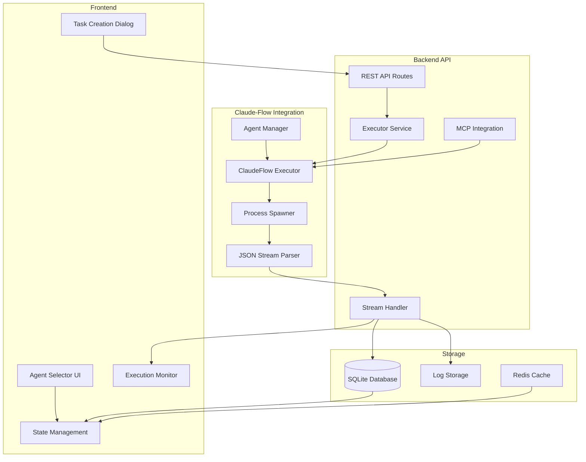
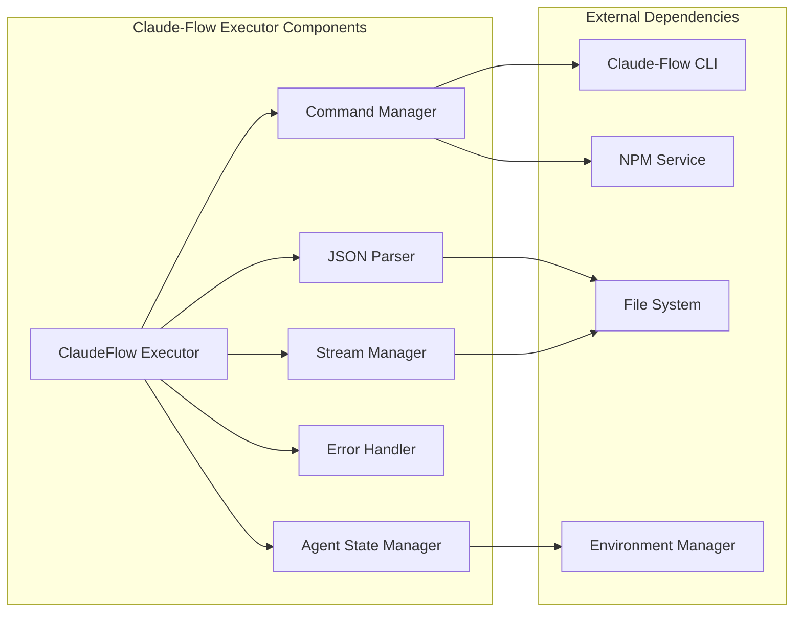
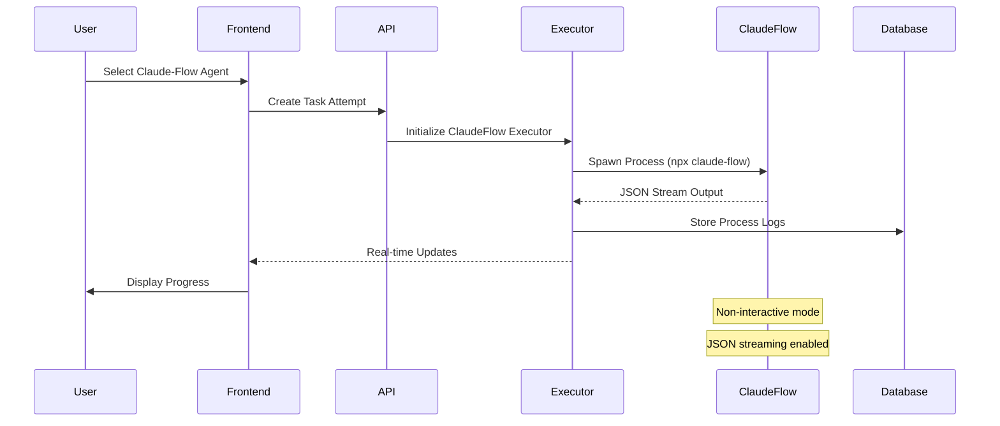

# Claude-Flow Integration Architecture Design

## Executive Summary

This document outlines the comprehensive architecture for integrating Claude-Flow as a coding agent within the vibe-kanban system. The integration will enable users to select Claude-Flow as an agent option for solving tasks, with full support for JSON streaming output, non-interactive mode execution, and seamless frontend/backend integration.

## Current System Analysis

### Architecture Overview

The vibe-kanban system follows a modular architecture with the following key components:

- **Backend (Rust)**: Multi-crate workspace with dedicated executors, services, and database models
- **Frontend (React + TypeScript)**: Vite-based SPA with Tailwind CSS
- **Database Models**: SQLite with SQLx ORM
- **Communication**: RESTful APIs with JSON payloads
- **Agent System**: Pluggable executor architecture supporting multiple coding agents

### Key Components Identified

1. **Executor System** (`/crates/executors/`)
   - Modular executor architecture supporting multiple agents
   - Already includes ClaudeCode, Cursor, Codex, Gemini, etc.
   - Base trait `StandardCodingAgentExecutor` for agent implementations
   - JSON schema definitions for agent configurations

2. **Database Models** (`/crates/db/src/models/`)
   - Task and execution process tracking
   - Session management for agent interactions
   - Workspace and repository state management

3. **API Routes** (`/crates/server/src/routes/`)
   - Task creation and management endpoints
   - Execution process handling
   - Session management

4. **Frontend Components**
   - Agent selection UI in `AgentSelector.tsx`
   - Executor profile management
   - Task attempt creation dialog

### Existing Agent Integration Points

The system already has a `ClaudeFlow` variant in the `CodingAgent` enum (line 95 in `/crates/executors/src/executors/mod.rs`), indicating preliminary support exists.

## Proposed Architecture

### High-Level Architecture Diagram



### Component Architecture



### Data Flow Diagram



## Implementation Design

### 1. ClaudeFlow Executor Implementation

Create a new executor in `/crates/executors/src/executors/claude_flow.rs`:

```rust
use async_trait::async_trait;
use serde::{Deserialize, Serialize};
use ts_rs::TS;
use schemars::JsonSchema;

#[derive(Debug, Clone, Serialize, Deserialize, TS, JsonSchema)]
pub struct ClaudeFlow {
    #[serde(default)]
    pub append_prompt: AppendPrompt,
    #[serde(default, skip_serializing_if = "Option::is_none")]
    pub output_format: Option<String>, // "stream-json"
    #[serde(default, skip_serializing_if = "Option::is_none")]
    pub non_interactive: Option<bool>,
    #[serde(default, skip_serializing_if = "Option::is_none")]
    pub chaining: Option<bool>,
    #[serde(flatten)]
    pub cmd: CmdOverrides,
}

#[async_trait]
impl StandardCodingAgentExecutor for ClaudeFlow {
    async fn spawn(
        &self,
        env: &ExecutionEnv,
        action: &ExecutorAction,
        approvals_service: Arc<dyn ExecutorApprovalService>,
        msg_store: MsgStore,
    ) -> Result<SpawnedChild, ExecutorError> {
        // Implementation details
    }
}
```

### 2. JSON Stream Processing

Implement a stream parser to handle NDJSON output:

```rust
use futures::StreamExt;
use serde_json::Value;

pub struct ClaudeFlowStreamParser {
    buffer: String,
    msg_store: MsgStore,
}

impl ClaudeFlowStreamParser {
    pub fn new(msg_store: MsgStore) -> Self {
        Self {
            buffer: String::new(),
            msg_store,
        }
    }

    pub async fn process_chunk(&mut self, chunk: &[u8]) -> Result<Vec<StreamMessage>, Error> {
        // Parse NDJSON stream
        // Handle different message types (init, message, tool_use, tool_result, result)
        // Store in msg_store
    }
}

#[derive(Debug, Clone, Serialize, Deserialize)]
pub enum StreamMessage {
    Init { session_id: String, timestamp: u64 },
    Message { role: String, content: String },
    ToolUse { id: String, name: String, input: Value },
    ToolResult { id: String, result: Value },
    Result { status: String, summary: String },
}
```

### 3. Command Building

Implement command construction for Claude-Flow:

```rust
impl ClaudeFlow {
    fn build_command(&self, action: &ExecutorAction) -> CommandBuilder {
        let mut builder = CommandBuilder::new("npx")
            .params(["-y", "@ruvnet/claude-flow"])
            .params(["--output-format", "stream-json"])
            .params(["--non-interactive"]);

        if self.chaining.unwrap_or(true) {
            builder = builder.params(["--chaining"]);
        }

        if let Some(prompt) = &self.append_prompt.0 {
            builder = builder.params(["--prompt", prompt]);
        }

        // Add task-specific arguments
        match action {
            ExecutorAction::CodingAgentInitial(req) => {
                builder = builder.params(["--task", &req.prompt]);
            }
            ExecutorAction::CodingAgentFollowUp(req) => {
                builder = builder.params(["--continue"]);
                builder = builder.params(["--context", &req.message]);
            }
        }

        builder
    }
}
```

### 4. Frontend Integration

Update the agent selector to include Claude-Flow:

```typescript
// In AgentSelector.tsx
const AGENT_CONFIGS = {
  CLAUDE_FLOW: {
    name: 'Claude Flow',
    icon: BotIcon,
    description: 'Multi-agent orchestration with streaming',
    capabilities: ['streaming', 'multi-agent', 'orchestration'],
  },
  // ... other agents
};
```

### 5. Database Schema Updates

Add Claude-Flow specific configuration:

```sql
-- Migration for Claude-Flow support
ALTER TABLE executor_profiles ADD COLUMN claude_flow_config JSON;
```

## Technical Specifications

### Requirements

1. **Non-Interactive Mode**: Claude-Flow must run in headless mode
2. **JSON Streaming**: Enable `--output-format stream-json` for structured output
3. **Agent Chaining**: Support `--chaining` flag for multi-agent workflows
4. **Error Handling**: Robust parsing of error states
5. **Performance**: Stream processing without blocking
6. **Security**: Input validation and sanitization

### API Endpoints

- `POST /api/task-attempts` - Create new attempt with Claude-Flow
- `GET /api/task-attempts/:id/logs` - Stream execution logs
- `GET /api/sessions/:id/execution-processes` - Get process status

### Data Models

```typescript
interface ClaudeFlowConfig {
  outputFormat: 'stream-json';
  nonInteractive: boolean;
  chaining: boolean;
  appendPrompt?: string;
  model?: string;
  customFlags?: string[];
}

interface StreamMessage {
  type: 'init' | 'message' | 'tool_use' | 'tool_result' | 'result';
  timestamp: number;
  data: any;
}
```

## Implementation Roadmap

### Phase 1: Core Implementation (Week 1)
- [ ] Implement ClaudeFlow executor struct
- [ ] Add JSON stream parsing logic
- [ ] Create command builder for Claude-Flow
- [ ] Update CodingAgent enum with proper serialization

### Phase 2: Integration (Week 2)
- [ ] Integrate with existing executor framework
- [ ] Implement spawn method with proper process handling
- [ ] Add stream processing to store logs
- [ ] Create database migrations if needed

### Phase 3: Frontend Updates (Week 3)
- [ ] Update AgentSelector component
- [ ] Add Claude-Flow configuration UI
- [ ] Implement real-time log streaming display
- [ ] Update task creation dialogs

### Phase 4: Testing & Polish (Week 4)
- [ ] Write comprehensive unit tests
- [ ] Create integration tests
- [ ] Implement Playwright tests
- [ ] Performance optimization
- [ ] Documentation updates

## Risk Assessment

### Technical Risks

1. **JSON Stream Parsing Complexity**
   - Risk: NDJSON parsing errors
   - Mitigation: Robust parser with fallback handling

2. **Process Management**
   - Risk: Zombie processes or resource leaks
   - Mitigation: Proper cleanup in Drop implementations

3. **Performance Bottlenecks**
   - Risk: Stream processing blocking main thread
   - Mitigation: Async processing with tokio

4. **Error Recovery**
   - Risk: Partial JSON messages
   - Mitigation: Buffering and validation logic

### Security Considerations

1. **Command Injection**
   - Validate all user inputs
   - Use parameterized commands
   - Sanitize file paths

2. **Resource Limits**
   - Implement timeout controls
   - Limit memory usage
   - Restrict file system access

## Testing Strategy

### Unit Tests
- JSON stream parser with various message types
- Command builder with different configurations
- Error handling scenarios
- Mock process spawning

### Integration Tests
- Full task execution flow
- Stream processing end-to-end
- Database persistence
- API endpoint testing

### E2E Tests (Playwright)
- Agent selection workflow
- Task creation with Claude-Flow
- Real-time log viewing
- Error scenario handling

## Monitoring & Observability

### Metrics
- Execution duration
- Success/failure rates
- Resource usage
- Stream processing latency

### Logging
- Structured JSON logs
- Execution traces
- Error contexts
- Performance metrics

## Future Enhancements

1. **Agent Chaining UI**: Visual workflow builder
2. **Custom Agent Support**: Plugin system for new agents
3. **Advanced Filtering**: Log filtering and search
4. **Performance Analytics**: Execution insights
5. **Multi-Workspace Support**: Parallel agent execution

## Conclusion

This architecture provides a robust, scalable integration of Claude-Flow into the vibe-kanban system. The design leverages existing patterns while adding powerful multi-agent orchestration capabilities through JSON streaming and non-interactive execution modes.

The implementation follows the established patterns in the codebase, ensuring consistency and maintainability while enabling advanced agent coordination features that Claude-Flow provides.