# Claude-Flow Integration Mermaid Diagrams

## System Architecture Overview

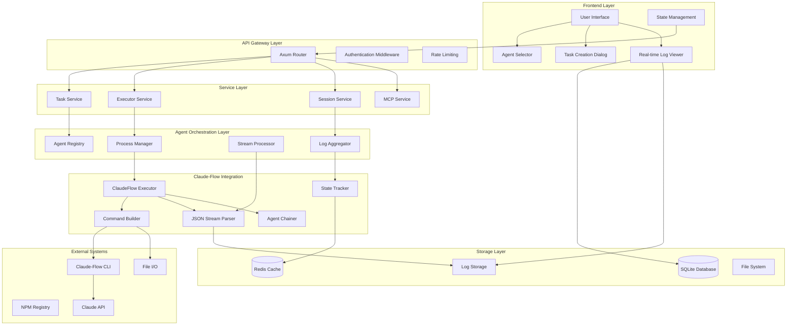

## Detailed Data Flow

### Task Creation Flow

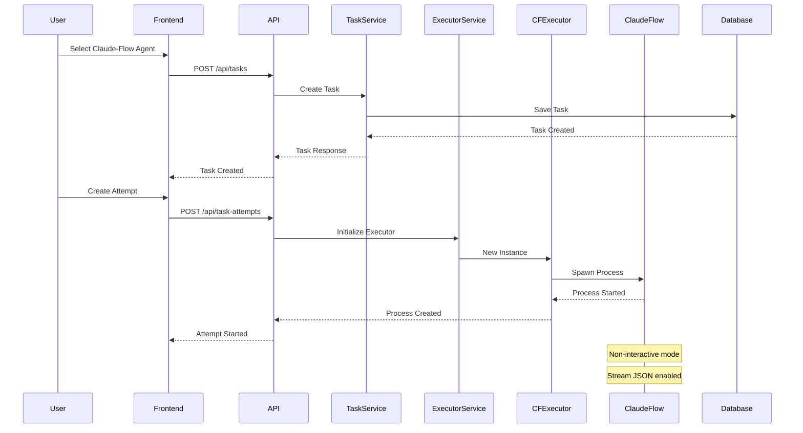

### JSON Streaming Flow

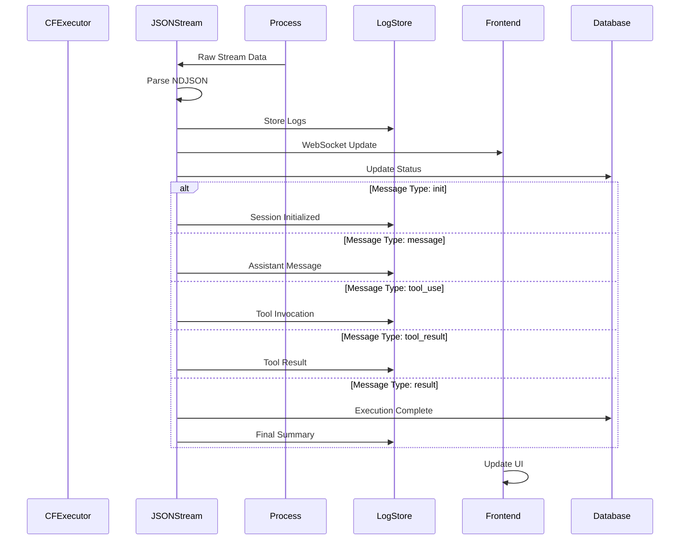

## Component Interaction Diagrams

### Claude-Flow Executor Architecture

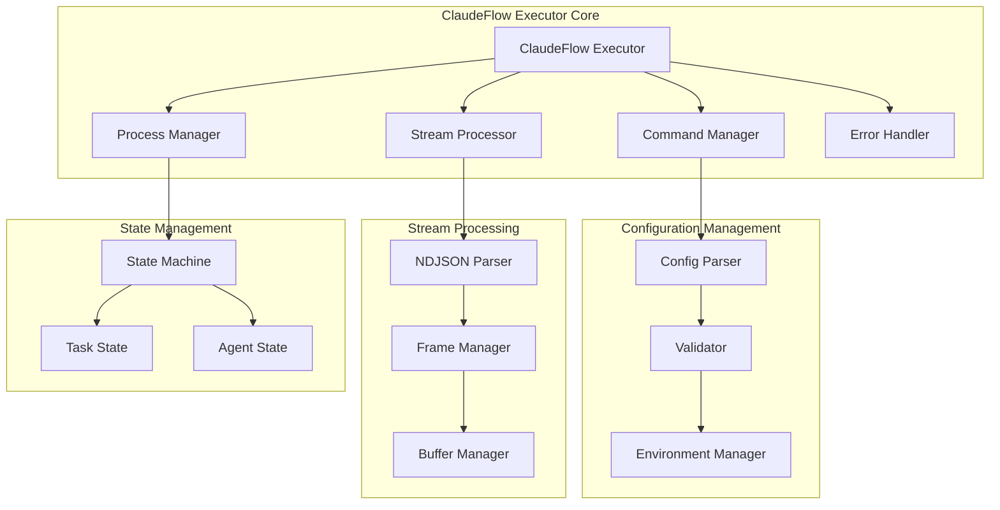

### Multi-Agent Orchestration

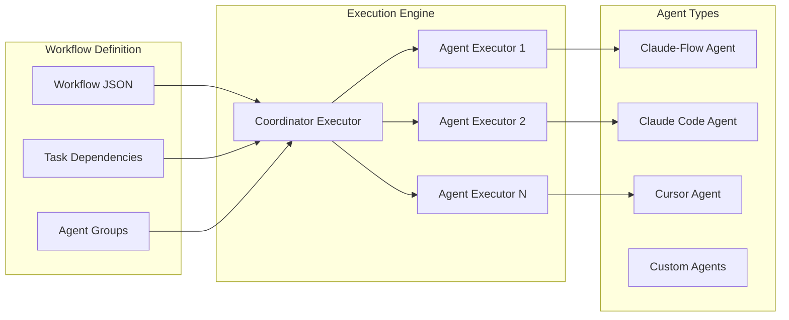

## Database Schema Evolution

### Current Schema

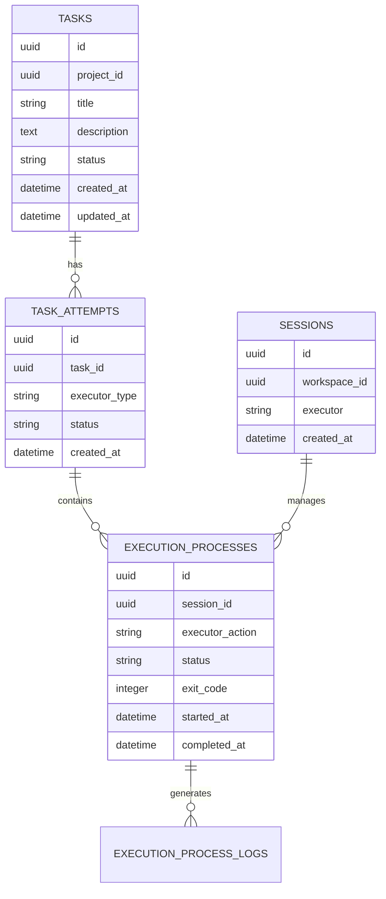

### Proposed Schema Extensions

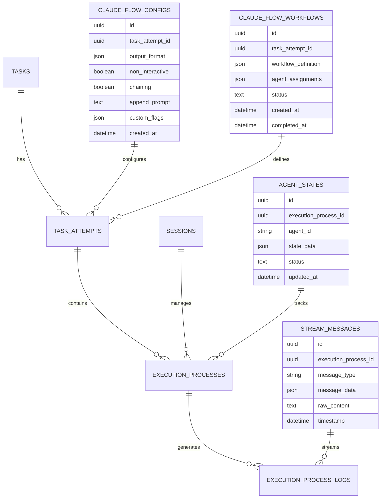

## API Flow Diagrams

### Task Execution Flow

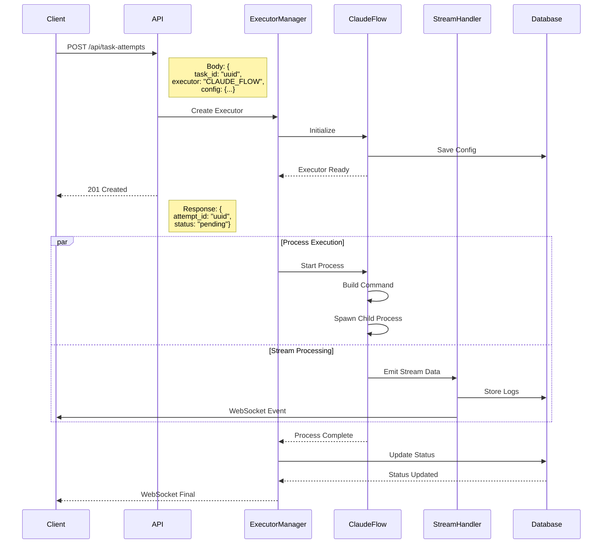

### WebSocket Real-time Updates

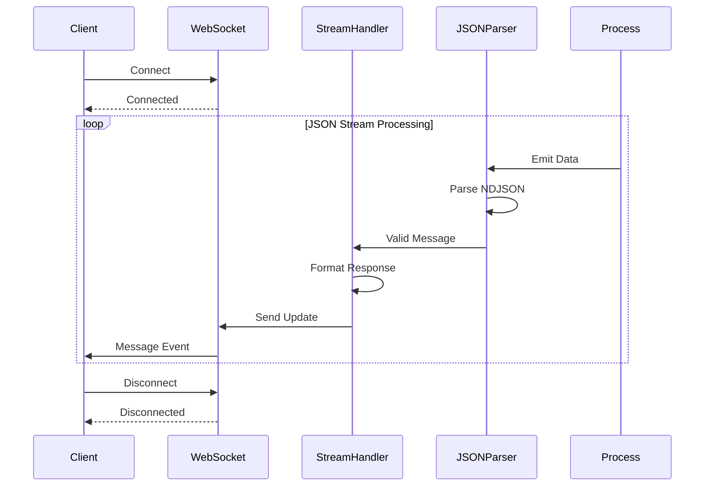

## Error Handling Flow

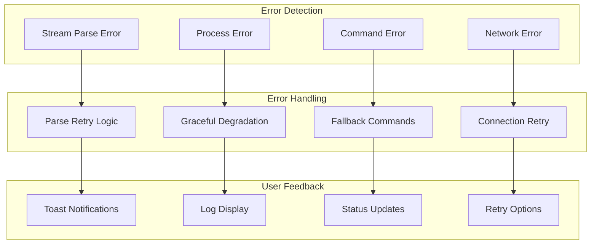

## Performance Optimization Flow

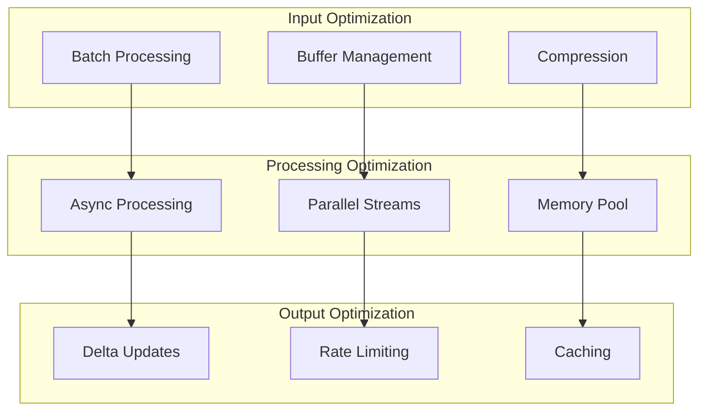

## Security Architecture

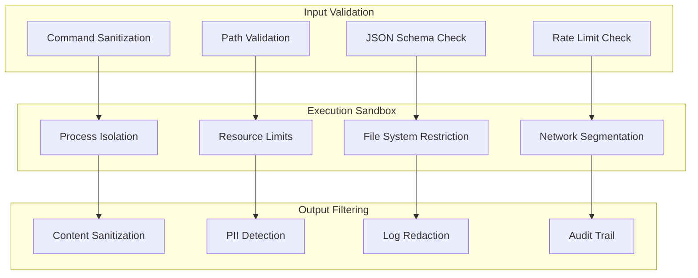

## Monitoring & Observability

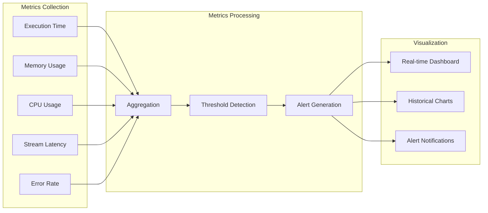

## Testing Architecture

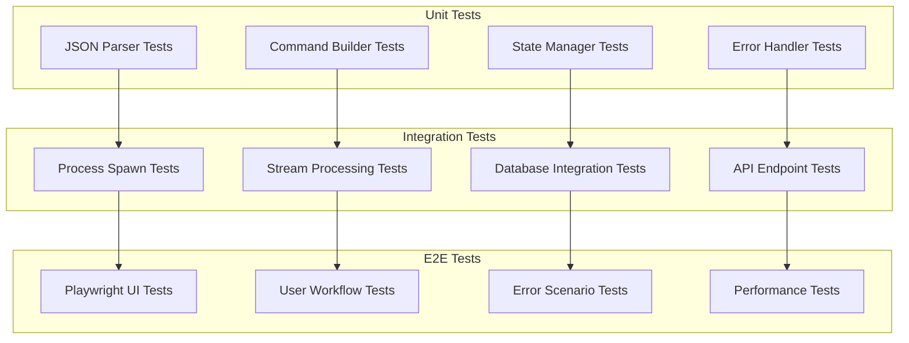

## Deployment Architecture

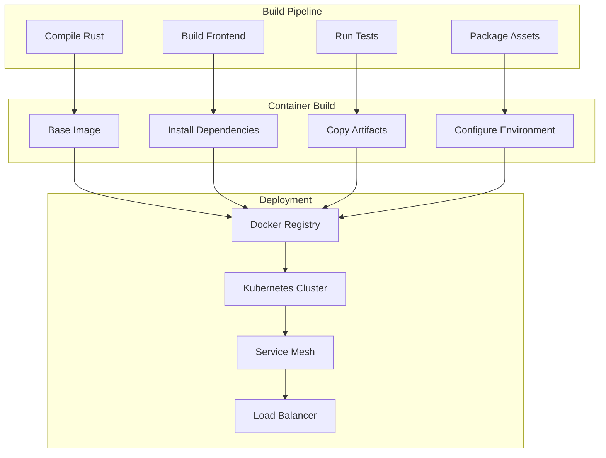

These diagrams provide a comprehensive visual representation of the Claude-Flow integration architecture, showing all key components, data flows, and system interactions required for a successful implementation.